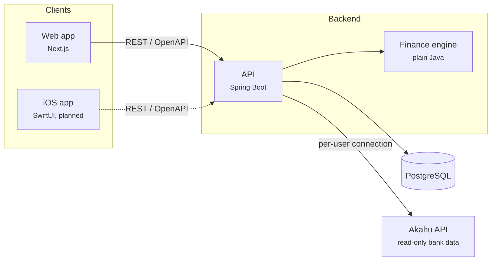

<div align="center">

# Kiwi Finance

**Personal finance, built for New Zealand.**

Understand where your money goes, build budgets that fit your real life, and get honest
answers to "Can I afford this?" in NZD, using New Zealand tax, KiwiSaver and living-cost
rules.


[Documentation](docs/README.md) ·
[Architecture](docs/architecture.md) ·
[API](docs/api.md) ·
[Akahu setup](docs/integrations/akahu.md) ·
[Configuration](docs/configuration.md) ·
[Roadmap](docs/roadmap.md)

</div>

---

## Why Kiwi Finance

Most budgeting tools are built for other markets and leave New Zealanders translating
everything themselves. Kiwi Finance starts from the New Zealand context: PAYE and the ACC
earners' levy, KiwiSaver contributions and first-home withdrawals, student loan
repayments, and the cost of rent, power and groceries here.

It is designed for people who are not financial experts. Every number comes with a plain
English explanation of how it was worked out and what it assumes.

## Features

| Feature | What it does for you |
| --- | --- |
| **Bank feeds** | Connect your own Akahu account to bring in transactions from ANZ, ASB, BNZ, Kiwibank, Westpac and more. A step-by-step guide adapts to where you are in the setup. |
| **Statement import** | Import CSV statements from ANZ, ASB, BNZ, Kiwibank and Westpac, with duplicates skipped automatically. |
| **Spending insights** | Money in and out by month, spending by category against the previous period, recurring bills and subscriptions, and plain-English insights. |
| **NZ pay calculator** | Gross to take-home pay with PAYE, ACC levy, KiwiSaver, student loan and your other loan repayments for the right tax year, including the employer's KiwiSaver after ESCT. Filled in from your profile when signed in, and free to use without an account. |
| **Realistic budgets** | Limits filled in from your actual spending, trimmed towards your own lower-spending months only when you need to save more. Start from common categories before your history builds up. |
| **Can I afford it?** | A clear verdict, the date you can realistically afford it, and the specific changes that would get you there sooner. Compare saving up with finance, then save the answer as a goal in one click. |
| **Emergency fund** | Choose the one account that holds your safety net. Its target is sized from your own essential costs, with milestones, a plan per pay and reminders you can turn off. |
| **Move money** | Record transfers, withdrawals and deposits between your accounts. Every figure, insight and projection updates straight away, and your bank's own transaction replaces the record when it arrives. |
| **Car and home planner** | Deposit, finance options, running costs and rent saved, with what a purchase does to your budget and other goals, before you commit. Save it as a goal or add its costs to your budget in one click. |
| **Cash withdrawals** | When an ATM withdrawal comes in, you're asked what the cash went on, so spending and budgets stay accurate. |
| **Guided setup** | New accounts start with a few short steps: pay, tax code, KiwiSaver, income, accounts and emergency fund. |
| **Your home screen** | Move, resize, add and remove widgets. Your layout is saved to your account. |
| **Goals** | Every goal shows how long until you get there and what it needs each month. Suggestions adjust amounts and dates by urgency and what you can afford, and each goal opens to its full details, history and actions. Reaching a goal is celebrated. |
| **Kiwi Score and progress** | One number for your financial health with the next step to improve it, the last 12 months of saving, and streaks and badges that reward good habits. |
| **Your account** | Change your name, email and password, download your data or delete your account. Changing your password signs you out everywhere else. |
| **Learn** | Short guides on KiwiSaver, payslips, emergency funds and buying a first home, and a glossary of NZ money terms. |

<div align="center">

**[Try the live demo](https://ovindusahan.github.io/kiwi-finance/)** with a sample customer, no sign-up needed.

</div>

## Architecture at a glance



All financial calculations run in the backend's finance engine, so the web app and the
planned iOS app always agree. See [Architecture](docs/architecture.md) for the full picture.

## Tech stack

| Layer | Technology |
| --- | --- |
| Backend | Java 21, Spring Boot 4.1, Spring Security, Spring Data JPA, Flyway, Lombok, Log4j2 |
| Database | PostgreSQL 16 |
| Web | Next.js 16, React 19, TypeScript, Tailwind CSS 4, Radix UI, TanStack Query, Recharts |
| Testing | JUnit 6, AssertJ, Spring MockMvc, Vitest, Testing Library, Playwright |
| iOS (planned) | Swift, SwiftUI |
| Bank data | Akahu (personal apps and OAuth) |
| Contract | OpenAPI 3.1, generated from the API |

## Repository layout

```text
kiwi-finance/
├── backend/            Spring Boot API and the finance engine (Gradle)
│   ├── api/
│   └── finance-engine/
├── web/                Next.js web app
│   ├── src/            App routes, features and the design system
│   ├── e2e/            Playwright journeys
│   └── demo/           Single-file demo build
├── contracts/          Generated OpenAPI contract
├── docs/               Architecture, API, data model, integrations, ADRs
├── infra/              PostgreSQL init scripts
├── .devcontainer/      GitHub Codespaces setup
├── .github/workflows/  CI
└── docker-compose.yml  PostgreSQL, the API and the web app
```

## Getting started

### Run it in GitHub Codespaces

1. On the repository page, choose **Code**, then the **Codespaces** tab, then **Create codespace on main**.
2. Wait while the codespace builds and starts the database, API and web app. The first start takes
   a few minutes; the terminal shows `Kiwi Finance is running at ...` when it is ready.
3. The app opens in a new browser tab. If it doesn't, open the **Ports** tab and select the globe
   icon next to **Kiwi Finance (3000)**.
4. Create your own account, or sign in as **`demo@kiwifinance.nz`** with password **`kiwi-demo-2026`**.

The codespace keeps your data while it exists. If you stop and restart it, the app starts again
on its own. To restart it by hand, run `bash .devcontainer/start.sh up` in the terminal.

### Use the app with Docker

The quickest way to run Kiwi Finance is with Docker. It needs nothing else installed.

```bash
docker compose up --build
```

Open http://localhost:3000 once the three services are up. Create your own account, or sign
in as **`demo@kiwifinance.nz`** with password **`kiwi-demo-2026`** to look around. Your data is kept in a Docker
volume, so it is still there the next time you start the app. Stop it with `Ctrl+C`, or
`docker compose down` to remove the containers (add `-v` to delete your data as well).

### Prerequisites for development

- Java 21
- Node.js 22
- Docker, for the local database

### Run everything for development

```bash
# 1. PostgreSQL with the development and test databases
docker compose up -d postgres

# 2. The API on http://localhost:8080, with the Akahu sandbox and a demo account
cd backend
./gradlew :api:bootRun --args='--spring.profiles.active=local,sandbox'

# 3. The web app on http://localhost:3000 (in a second terminal)
cd web
cp .env.example .env.local
npm install
npm run dev
```

Sign in as **`demo@kiwifinance.nz`** with password **`kiwi-demo-2026`** to explore 13 months
of realistic data, or create your own account and connect the sandbox bank with any tokens
starting `app_token_sandbox` and `user_token_sandbox`.

The `local` and `sandbox` profiles ship with development-only secrets. Every other
environment must provide its own; see [Configuration](docs/configuration.md).

### Run the tests

```bash
# Backend: formatting, unit and integration tests, and the API contract check
cd backend && ./gradlew build

# Web: formatting, lint, types and unit tests
cd web && npx prettier --check . && npm run lint && npm run typecheck && npm test

# End-to-end journeys, with the API (sandbox) and web app running
cd web && npm run test:e2e
```

Backend integration tests use the `kiwi_finance_test` database created by Docker Compose.
Run these checks before pushing. CI runs the same checks on GitHub, kept lean so it stays fast:

| Job | When it runs | What it checks |
| --- | --- | --- |
| Backend | When `backend/` or the contract changes | Formatting, build, unit and integration tests, and that the API contract is up to date |
| Web | When `web/` or the contract changes | API types against the contract, formatting, lint, types, unit tests and a production build |
| End-to-end | Once per push to `main`, after the others pass, or on demand | Every journey and the WCAG 2.2 AA checks against a real API and database |

Runs on the same branch cancel each other, dependencies are cached, and logs are kept for
five days only when something fails.

When CI passes on `main`, the **Deploy demo** workflow rebuilds the demo from fresh sandbox
data and publishes it to GitHub Pages.

### Try the demo

The live demo at **https://ovindusahan.github.io/kiwi-finance/** runs the real interface on
recorded sandbox data for a sample customer, with no server behind it. Changes you make in it
stay in your browser tab and are never saved.

To build it yourself:

```bash
cd web
npm run demo:record   # with the sandbox API running
npm run demo:build    # writes demo/dist/index.html
```

## Project status

| Phase | Scope | Status |
| :-: | --- | --- |
| 0 | Foundation: build, local infrastructure, CI, API skeleton | Complete |
| 1 | Accounts, transactions, authentication, CSV import and Akahu bank feeds | Complete |
| 2 | NZ tax and KiwiSaver rules, spending analysis, insights | Complete |
| 3 | Budgets, goals, emergency fund, affordability, purchase planning, Kiwi Score | Complete |
| 4 | Next.js web app | Complete |
| 5 | iOS app | Planned |

The detailed plan lives in the [Roadmap](docs/roadmap.md).

## Contributing

The repository follows Git Flow: `main` holds releases, `develop` integrates finished work,
and each feature is built on its own `feature/` branch with its tests and documentation.
Commits follow Conventional Commits. See the
[engineering guidelines](docs/engineering-guidelines.md#9-git-workflow).

## Documentation

Start at the [documentation index](docs/README.md). Highlights:

- [Architecture](docs/architecture.md): system design and the reasoning behind it
- [Data model](docs/data-model.md): tables, relationships and conventions
- [API](docs/api.md): conventions and endpoint reference
- [New Zealand financial rules](docs/nz-financial-rules.md): tax, KiwiSaver and planning logic
- [Akahu integration](docs/integrations/akahu.md): how users connect their banks
- [Configuration](docs/configuration.md): environment variables, profiles and secrets
- [Engineering guidelines](docs/engineering-guidelines.md): how we write and ship code

## Disclaimer

Kiwi Finance provides general information and projections to help you understand your own
finances. It does not provide regulated financial advice. For personalised advice,
talk to a licensed financial adviser.
