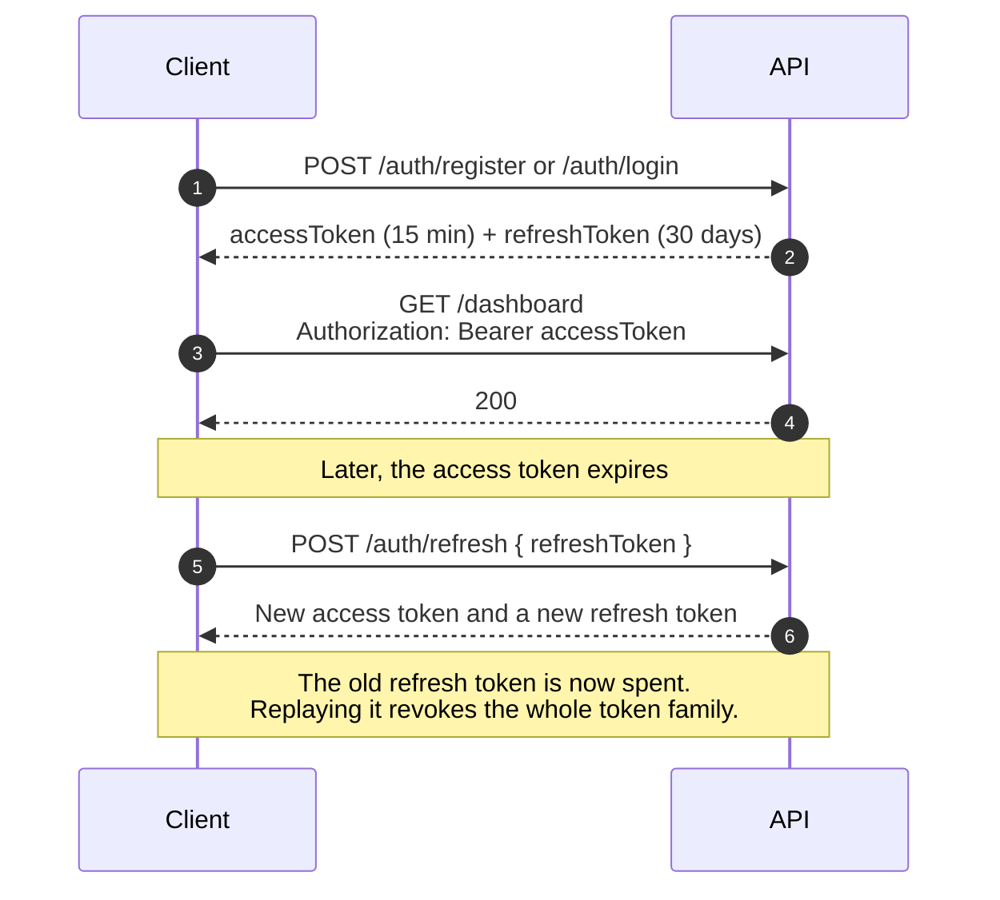

# API

> Conventions and the endpoint catalogue for the Kiwi Finance API.

The API is the only place financial logic runs. The web app calls it through its own server,
and the iOS app will call it directly. The machine-readable contract is
[`contracts/openapi.json`](../contracts/openapi.json) (OpenAPI 3.1), generated from the code
and checked by the contract test. A running API also serves it at `/api/v1/openapi.json`.

**Contents**

1. [Conventions](#1-conventions)
2. [Authentication](#2-authentication)
3. [Errors](#3-errors)
4. [Pagination](#4-pagination)
5. [Explanations](#5-explanations)
6. [Endpoint catalogue](#6-endpoint-catalogue)
7. [Examples](#7-examples)

---

## 1. Conventions

| Topic | Convention |
| --- | --- |
| Base path | `/api/v1` |
| Format | JSON with `camelCase` fields. Every response field is always present; absent values are `null`. |
| Money | `{ "cents": 123450, "currency": "NZD" }` in responses. Requests send whole cents in fields ending `Cents`, for example `"amountCents": -8450`. |
| Signs | Money in is positive and money out is negative, matching a bank statement. |
| Dates | Calendar dates are `YYYY-MM-DD` in New Zealand time. Months are `YYYY-MM`. Moments are ISO 8601 UTC timestamps. |
| Rates | Fractions, so 3.5% is `0.035`. |
| Identifiers | UUIDv7 strings. |
| Ownership | Every resource belongs to one person. Another person's resource returns `404`, never `403`, so its existence is not revealed. |
| Clearing a value | `PATCH` leaves omitted fields alone. Text fields are cleared with an empty string. Categories are set or cleared with `PUT /transactions/{id}/category`. |

---

## 2. Authentication



- Access tokens are signed JWTs sent as `Authorization: Bearer <token>`.
- Refresh tokens are opaque, single-use and rotated on every refresh.
- Five failed sign-ins lock the account for 15 minutes (`429 too_many_login_attempts`).
- `POST /auth/logout` revokes a refresh token. `DELETE /auth/me` deletes the account and
  everything in it after confirming the password.
- `PATCH /auth/me` changes the display name or email. A new email needs the current password
  (`422 wrong_password` otherwise) and must not belong to another account.
- `POST /auth/me/password` changes the password, revokes every refresh token the person holds
  and returns a fresh token pair for the device that made the change. The web app calls it
  through its own `/api/auth/password` route so the new tokens go straight into the session
  cookies.

The web app never exposes tokens to the browser. Its server keeps them in `HttpOnly`
cookies and forwards requests through `/api/proxy`, refreshing once when the API answers
`401`.

---

## 3. Errors

Errors use [RFC 9457](https://www.rfc-editor.org/rfc/rfc9457) problem details with a
stable `code` that clients can rely on. Validation failures list each field.

```json
{
  "type": "about:blank",
  "title": "Validation failed",
  "status": 400,
  "detail": "Some fields need attention.",
  "code": "validation_failed",
  "errors": [{ "field": "targetCents", "message": "must be greater than 0" }]
}
```

| Status | Codes |
| :-: | --- |
| 400 | `validation_failed`, `malformed_request`, `invalid_cursor`, `oauth_state_invalid` |
| 401 | `unauthenticated`, `invalid_credentials`, `invalid_refresh_token` |
| 403 | `access_denied` |
| 404 | `not_found` |
| 405 | `method_not_allowed` |
| 409 | `email_already_registered`, `account_managed_by_bank_feed`, `account_archived`, `category_read_only`, `category_name_taken`, `transaction_managed_by_bank_feed`, `bank_connection_exists`, `bank_connection_not_active`, `bank_connection_different_user`, `bank_feed_account_link_invalid`, `sync_in_progress`, `akahu_oauth_not_configured`, `goal_not_active` |
| 413 | `import_too_large` |
| 422 | `wrong_password`, `insufficient_funds`, `akahu_tokens_rejected`, `import_format_unrecognised` |
| 429 | `too_many_login_attempts` |
| 500 | `internal_error` |
| 502 | `akahu_unavailable` |

---

## 4. Pagination

Transactions use keyset (cursor) pagination, newest first, so pages stay stable while new
transactions arrive.

```http
GET /api/v1/transactions?limit=50
GET /api/v1/transactions?limit=50&cursor=eyJk...
```

```json
{ "items": [ ... ], "nextCursor": "eyJk..." }
```

`nextCursor` is `null` on the last page. Cursors are opaque; a tampered cursor returns
`400 invalid_cursor`.

---

## 5. Explanations

Every calculated result carries an `explanation` so clients can show "How we worked this
out" without doing any maths themselves.

```json
{
  "summary": "Borrowing $14,000 over 4 years costs $377.54 a month and $3,772 in interest plus $350 in fees.",
  "steps": [{ "label": "Amount borrowed", "value": "$14,350.00", "detail": "Includes $350.00 of fees." }],
  "assumptions": [
    {
      "key": "fixed_rate",
      "label": "Fixed rate",
      "value": "The interest rate stays the same for the whole term.",
      "source": null
    }
  ]
}
```

---

## 6. Endpoint catalogue

All paths are under `/api/v1`. Endpoints marked **public** need no access token.

### Identity

| Method | Path | Purpose |
| :-: | --- | --- |
| `POST` | `/auth/register` | Create an account. **Public** |
| `POST` | `/auth/login` | Sign in. **Public** |
| `POST` | `/auth/refresh` | Rotate the refresh token and get a new access token. **Public** |
| `POST` | `/auth/logout` | Revoke a refresh token. **Public** |
| `GET` | `/auth/me` | The signed-in person |
| `PATCH` | `/auth/me` | Change the display name or email |
| `POST` | `/auth/me/password` | Change the password and end every other session |
| `GET` | `/auth/me/export` | Download everything stored about the person as JSON, without secrets |
| `DELETE` | `/auth/me` | Delete the account and all data, after confirming the password |
| `GET` `PUT` | `/profile` | Pay frequency, tax code, KiwiSaver, household and saving settings |
| `GET` `PATCH` | `/preferences` | App preferences, such as emergency fund reminders |
| `PUT` | `/preferences/home-layout` | Save the home screen widgets, their order and sizes; send `null` for the default |
| `POST` | `/preferences/emergency-fund-reminder/snooze` | Hide the emergency fund reminder for two weeks |

### Money data

| Method | Path | Purpose |
| :-: | --- | --- |
| `GET` `POST` | `/accounts` | List (optionally with archived) or create accounts |
| `GET` `PATCH` `DELETE` | `/accounts/{id}` | Read, update or delete an account |
| `GET` `POST` | `/categories` | NZ system categories plus the person's own |
| `PATCH` `DELETE` | `/categories/{id}` | Update or delete a custom category |
| `GET` `POST` | `/categorisation-rules` | Rules that categorise new transactions |
| `PATCH` `DELETE` | `/categorisation-rules/{id}` | Update or delete a rule |
| `GET` `POST` | `/transactions` | Search and filter (account, category, uncategorised, direction, dates, text) or add manually |
| `GET` `PATCH` `DELETE` | `/transactions/{id}` | Read, edit or delete a transaction |
| `PUT` | `/transactions/{id}/category` | Set or clear one transaction's category |
| `POST` | `/transactions/categorise` | Set the category of many transactions |
| `POST` | `/transactions/recategorise` | Re-apply rules to transactions not categorised by hand |
| `GET` | `/cash-withdrawals` | Recent ATM and cash withdrawals the person hasn't said what they spent on |
| `POST` | `/cash-withdrawals/{transactionId}` | Split a cash withdrawal into categorised spending; whatever is left stays in a cash wallet account |
| `GET` `POST` | `/imports` | List imports, or upload a CSV statement (multipart) |
| `GET` `POST` | `/income-sources` | Income sources with take-home pay worked out |
| `PUT` `DELETE` | `/income-sources/{id}` | Update or delete an income source |
| `POST` | `/income/pay-calculator` | Gross to take-home pay with PAYE, ACC, KiwiSaver and student loan. **Public** |
| `GET` `POST` | `/money-movements` | Recent transfers, withdrawals and deposits, or record one. Balances and transactions update straight away; on bank-fed accounts the bank's own transaction replaces the recorded one when it arrives. A move can take an everyday, savings or cash account at most $100 overdrawn (`422 insufficient_funds` otherwise). Credit cards and loans are exempt, as spending on them adds to the debt |

### Bank feeds

| Method | Path | Purpose |
| :-: | --- | --- |
| `GET` | `/bank-feeds/akahu/setup-guide` | The setup guide, tailored to the person's progress |
| `POST` | `/bank-feeds/akahu/personal-connections` | Connect with personal app tokens |
| `PUT` | `/bank-feeds/akahu/connections/{id}/credentials` | Replace personal app tokens |
| `POST` | `/bank-feeds/akahu/oauth/authorisations` | Start the Akahu OAuth flow and get the consent URL |
| `POST` | `/bank-feeds/akahu/oauth/callback` | Finish the OAuth flow with the returned code and state |
| `GET` | `/bank-feeds/connections` | Connections with their accounts and latest sync |
| `GET` `DELETE` | `/bank-feeds/connections/{id}` | Read or disconnect (revokes access at Akahu) |
| `PATCH` | `/bank-feeds/connections/{id}/accounts/{feedAccountId}` | Turn sync on or off, or link to an existing account |
| `GET` `POST` | `/bank-feeds/connections/{id}/syncs` | Sync history, or start a sync (`202`) |
| `GET` | `/bank-feeds/connections/{id}/syncs/{runId}` | One sync run |

### Insight and planning

| Method | Path | Purpose |
| :-: | --- | --- |
| `GET` | `/dashboard` | Everything the home screen needs in one call |
| `GET` | `/analysis/cashflow?months=12` | Money in and out by month, plus a typical month |
| `GET` | `/analysis/spending?months=3` | Spending by category against the previous period |
| `GET` | `/analysis/recurring` | Bills, subscriptions and regular income, with next expected dates |
| `GET` | `/insights` | Plain-English observations ranked by importance, drawn from spending history, the budget, goals, debt, upcoming bills and account balances, each with a suggested action |
| `GET` | `/budgets/recommendation` | A budget built from real spending |
| `POST` | `/budgets` | Create the active budget |
| `GET` | `/budgets/current?month=YYYY-MM` | Budget progress for a month |
| `PUT` `DELETE` | `/budgets/{id}` | Update or delete a budget |
| `GET` `POST` | `/goals` | Goals with projections and milestones |
| `GET` | `/goals/plan` | How to share what the person can save across their goals, most urgent first, with one suggestion per goal |
| `GET` `PUT` `DELETE` | `/goals/{id}` | Read, update or delete a goal |
| `PUT` | `/goals/{id}/status` | Pause, resume, achieve or archive |
| `GET` `POST` | `/goals/{id}/contributions` | Money added to or taken from a goal |
| `GET` | `/emergency-fund` | Target, progress, milestones, a plan and the chosen account |
| `PUT` | `/emergency-fund/account` | Choose the one account that holds the emergency fund, or clear it |
| `POST` | `/planning/affordability` | "Can I afford it?" with a verdict, dates and levers |
| `POST` | `/planning/loan` | Repayments and total cost of a loan. **Public** |
| `POST` | `/planning/purchase-impact` | What a car, home or other big purchase would cost: deposit, loan and term options, one-off and running costs, the effect on the monthly budget and which goals would slow down |
| `GET` `POST` | `/planning/purchase-plans` | Saved purchase plans with a fresh assessment |
| `GET` `PUT` `DELETE` | `/planning/purchase-plans/{id}` | Read, update or delete a plan |
| `POST` | `/planning/purchase-plans/{id}/goal` | Turn a plan into a savings goal |
| `GET` | `/progress` | Kiwi Score, streaks and achievements |
| `GET` | `/education/guides` | Guides. **Public** |
| `GET` | `/education/guides/{slug}` | One guide. **Public** |
| `GET` | `/education/glossary` | NZ money terms in plain English. **Public** |

### Operations

| Method | Path | Purpose |
| :-: | --- | --- |
| `GET` | `/actuator/health` | Liveness and readiness. **Public** |
| `GET` | `/api/v1/openapi.json` | The live contract. **Public** |

---

## 7. Examples

### Can I afford it?

```http
POST /api/v1/planning/affordability
Authorization: Bearer eyJhbGciOi...
Content-Type: application/json

{ "itemName": "a new laptop", "priceCents": 250000, "funding": "CASH" }
```

```json
{
  "verdict": "SAVE_UP",
  "headline": "You could afford a new laptop by May 2027 by saving $171 a fortnight.",
  "price": { "cents": 250000, "currency": "NZD" },
  "availableNow": { "cents": 0, "currency": "NZD" },
  "shortfall": { "cents": 250000, "currency": "NZD" },
  "monthlySavingCapacity": { "cents": 37000, "currency": "NZD" },
  "requiredPerPayPeriod": { "cents": 17077, "currency": "NZD" },
  "payPeriod": "fortnight",
  "realisticDate": "2027-05-01",
  "levers": [
    {
      "kind": "REDUCE_SPENDING",
      "title": "Spend $37 less on Entertainment",
      "description": "You usually spend $153 a month on Entertainment, but some months only $77. Matching your lower months frees up $80 a month.",
      "monthlyAmount": { "cents": 8000, "currency": "NZD" },
      "perPayPeriod": { "cents": 3692, "currency": "NZD" },
      "resultingDate": "2027-04-01",
      "monthsSooner": 1
    }
  ],
  "explanation": { "summary": "...", "steps": [], "assumptions": [] }
}
```

The verdict is one of `AFFORDABLE_NOW`, `ON_TRACK`, `SAVE_UP`, `NEEDS_CHANGES` or
`OUT_OF_REACH`. The rules behind it are in
[New Zealand financial rules](nz-financial-rules.md#7-affordability).

### Pay calculator

```http
POST /api/v1/income/pay-calculator
Content-Type: application/json

{ "amountCents": 6500000, "frequency": "ANNUALLY", "basis": "GROSS", "taxCode": "M", "kiwiSaverRate": 0.035 }
```

The response gives annual and per-period amounts for income tax (after the independent
earner tax credit), the credit itself, the ACC earners' levy, KiwiSaver, student loan and
take-home pay, plus the employer's KiwiSaver contribution after ESCT.
