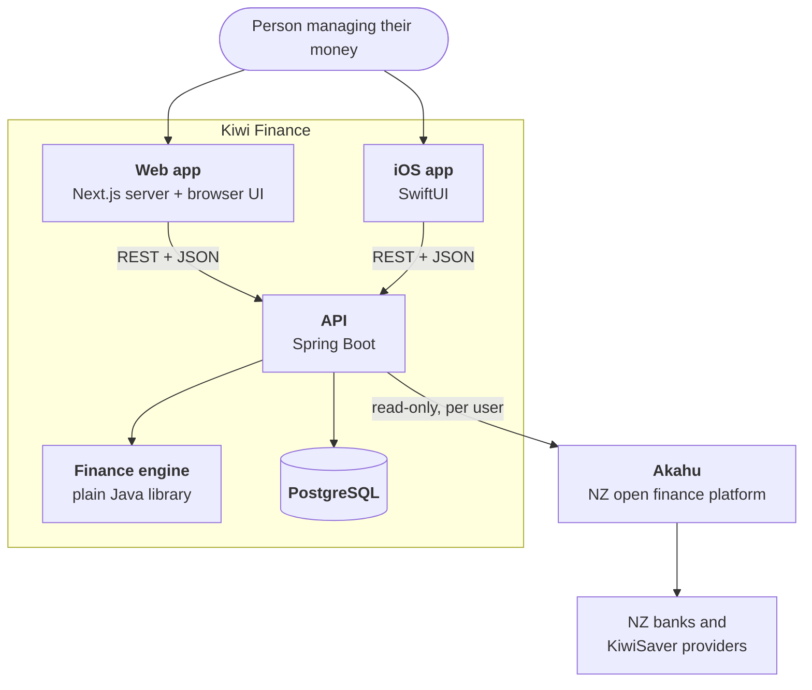
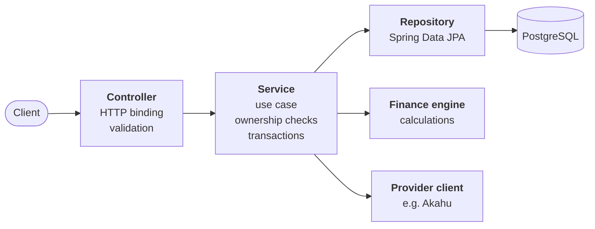
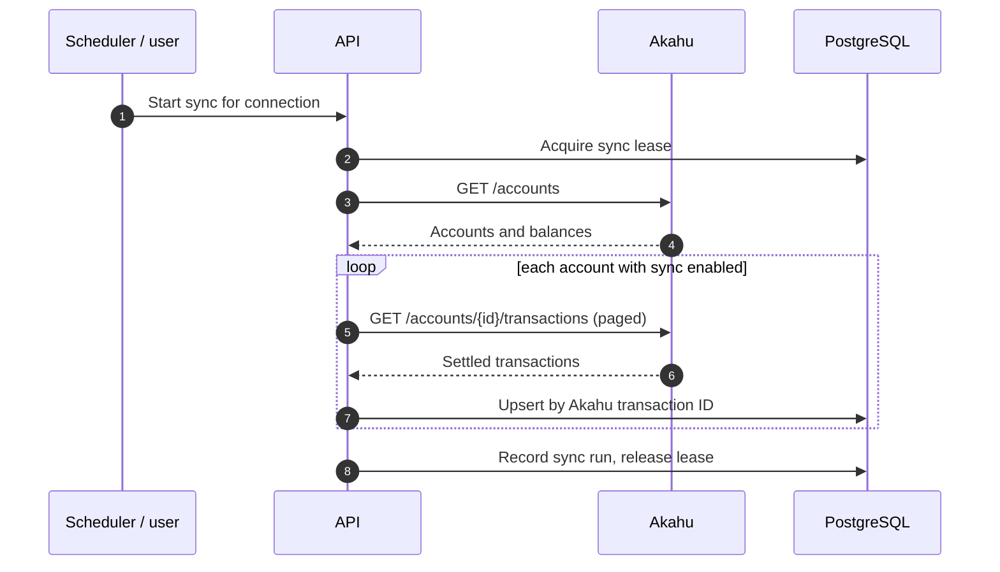
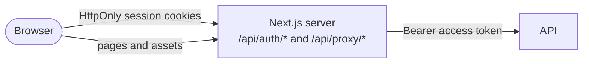

# Architecture

> How Kiwi Finance is put together, and the reasoning behind it.

**Contents**

1. [Goals and constraints](#1-goals-and-constraints)
2. [System context](#2-system-context)
3. [Technology choices](#3-technology-choices)
4. [Backend design](#4-backend-design)
5. [Explainable results](#5-explainable-results)
6. [Bank feeds](#6-bank-feeds)
7. [Web application](#7-web-application)
8. [iOS application](#8-ios-application)
9. [Security](#9-security)
10. [Testing strategy](#10-testing-strategy)
11. [Sandbox and demo](#11-sandbox-and-demo)
12. [Extending the system](#12-extending-the-system)

---

## 1. Goals and constraints

### Product goals

Kiwi Finance helps New Zealanders understand and manage their money. It analyses real
transactions and income, recommends budgets, tracks goals, and answers questions such as
*"Can I afford this?"*, *"Can I get this by March?"* and *"What would I need to change?"*

Everything is in NZD and uses New Zealand rules: PAYE, the ACC earners' levy, KiwiSaver,
student loan repayments and common New Zealand living costs.

### Quality attributes

| Attribute | What it means here |
| --- | --- |
| **Correct money** | No floating-point currency anywhere. Amounts are integer cents. |
| **One source of truth** | Financial logic runs on the server only. Web and iOS display results and never recalculate them. |
| **Explainable** | Every projection and recommendation returns its working and assumptions in a form the UI can show to non-experts. |
| **Rules as data** | Tax and KiwiSaver settings change most years. They are versioned by tax year and selected by date. |
| **Private by default** | Strict per-user isolation, encrypted bank-feed credentials, nothing sensitive in logs. Designed around the Privacy Act 2020. |
| **Easy to extend** | New capabilities arrive as new feature packages without reshaping existing ones. |
| **Accessible** | WCAG 2.2 AA on the web, checked automatically on every page; Dynamic Type and VoiceOver on iOS. |

### Out of scope for the first release

- Shared or household finances
- Investment portfolio tracking beyond balances
- Push notifications and reminders
- Akahu webhooks (available to registered Akahu apps only; scheduled sync covers v1)
- Regulated financial advice. The product gives information and projections, and says so.

---

## 2. System context



| Component | Responsibility |
| --- | --- |
| **Web app** | Next.js acts as a backend-for-frontend. It renders the UI, keeps tokens in secure server-side cookies and calls the API on the user's behalf. |
| **iOS app** | Native SwiftUI client using a generated API client. Arrives after the web app. |
| **API** | Authentication, data ownership, persistence, bank-feed sync, and the HTTP surface for every feature. |
| **Finance engine** | Pure calculation library: money, NZ rules, analysis, budgeting and planning. No framework, no I/O. |
| **PostgreSQL** | System of record for users, accounts, transactions, connections, budgets and goals. |
| **Akahu** | Supplies account balances and transactions from the user's banks through a connection the user owns. |

---

## 3. Technology choices

| Concern | Choice | Why |
| --- | --- | --- |
| Backend language | **Java 21** | Records, sealed types and virtual threads; a long-term support release |
| Backend framework | **Spring Boot 4.1**, Spring MVC on virtual threads | Proven for financial systems, with first-class security, data access and scheduling |
| Boilerplate and logging | **Lombok** and **Log4j2** | Generated constructors, getters and loggers keep classes focused on behaviour; Log4j2 handles logging |
| Build | **Gradle** (Kotlin DSL) multi-project with a version catalog | Keeps `finance-engine` and `api` separate, with one place for dependency versions |
| Database | **PostgreSQL 16** | Transactions, constraints and precise numeric and date types |
| Persistence | **Spring Data JPA** + **Flyway** | Standard data access with reviewed, versioned SQL migrations |
| Authentication | **Spring Security**, signed JWT access tokens, rotating refresh tokens, Argon2id | Works the same for the Next.js server and the iOS app |
| API contract | **OpenAPI 3.1** from springdoc, committed to `contracts/` | Web types and the Swift client are generated from one document |
| Bank data | **Akahu** | One read-only API across the major NZ banks |
| Web | **Next.js** (App Router), TypeScript, Tailwind CSS, Radix UI, Recharts | Server components and route handlers keep secrets off the browser; accessible primitives |
| iOS | **Swift**, **SwiftUI**, swift-openapi-generator | Native experience on a generated, type-safe client |

The decisions with the widest impact are recorded as ADRs:
[repository layout](adr/0001-monorepo.md),
[server-side financial logic](adr/0002-server-side-financial-logic.md),
[money representation](adr/0003-money-representation.md),
[versioned NZ rules](adr/0004-versioned-nz-rules.md),
[Spring Boot and Next.js](adr/0005-spring-boot-and-nextjs.md) and
[Akahu bank feeds](adr/0006-akahu-bank-feeds.md).

---

## 4. Backend design

### 4.1 Modules

```mermaid
flowchart LR
    subgraph api["api (Spring Boot)"]
        direction TB
        auth[auth]
        account[account]
        category[category]
        transaction[transaction]
        bankfeed["bankfeed<br/><small>+ akahu</small>"]
        planning["analysis · budget<br/>goal · planning"]
        engagement["dashboard · progress<br/>education"]
        sandbox["sandbox<br/><small>dev profile only</small>"]
        common[common]
    end

    subgraph engine["finance-engine (plain Java)"]
        direction TB
        money[money]
        nzrules[nzrules · tax]
        calc["analysis · budgeting<br/>planning · explain"]
        progress["score · progress<br/>insights"]
    end

    api --> engine
```



The backend is a Gradle build with two modules:

- **`finance-engine`** holds every financial calculation. It depends on nothing but the
  JDK, which keeps it fast to test and impossible to couple to HTTP or the database.
- **`api`** is the Spring Boot application. It is organised **by feature**, so everything
  about accounts lives in `account`, everything about bank feeds lives in `bankfeed`, and
  so on.

### 4.2 Layers inside a feature



| Layer | Rules |
| --- | --- |
| **Controller** | Binds and validates requests, calls one service method, maps the result to a response record. No business logic. |
| **Service** | Implements a use case inside a transaction. Resolves the current user's data and enforces ownership. |
| **Repository** | Database access. Every lookup of user-owned data takes the user ID, so it is not possible to load another person's records by accident. |
| **Finance engine** | Receives plain values, returns results and explanations. Never touches I/O. |

Types are package-private unless another feature genuinely needs them. Cross-feature calls
go through a service, never through another feature's repository.

### 4.3 Cross-cutting concerns

| Concern | Approach |
| --- | --- |
| Errors | A single `ApiException` hierarchy with stable error codes, translated to RFC 9457 problem details in one handler |
| Validation | Jakarta Bean Validation on request records |
| Transactions | `@Transactional` on service methods; external calls happen outside database transactions |
| Time | An injected `Clock`; calendar dates are New Zealand local dates (`Pacific/Auckland`) |
| Configuration | Typed, validated `@ConfigurationProperties` records; the app refuses to start with missing secrets |
| Observability | Spring Boot Actuator health checks and structured logs with no personal or financial data |

---

## 5. Explainable results

Every analysis and planning result carries an explanation that the clients render as
"How we worked this out".

```java
public record Explanation(String summary, List<Step> steps, List<Assumption> assumptions) {

    public record Step(String label, String value, String detail) {}

    public record Assumption(String key, String label, String value, String source) {}
}
```

Each assumption names its source, for example *"IRD tax rates 2026/27"* or *"your last
6 months of spending"*, so a person can see exactly what a number depends on and what
would change it.

---

## 6. Bank feeds

Each person connects **their own Akahu account**. Kiwi Finance never sees bank login
details, and access is read-only. Two connection methods are supported:

| Method | Experience | Available when |
| --- | --- | --- |
| **Personal app** | The person creates a personal app in Akahu and pastes its two tokens into Kiwi Finance | Always |
| **Akahu OAuth** | "Connect with Akahu" opens Akahu's consent screen and returns | The deployment is registered with Akahu and its app credentials are configured |

The API serves a **setup guide tailored to each person**. It lists the methods available on
that deployment and marks each step as done, current or still to do, based on that
person's connection, linked accounts and sync history. The web and iOS apps render it as a
wizard, so guidance is identical on every platform.



Full details, including the user-facing steps, are in the
[Akahu integration guide](integrations/akahu.md).

---

## 7. Web application



The browser never holds an access or refresh token. Sign-in and sign-up go through Next.js
route handlers that store both tokens in `HttpOnly`, `SameSite=Lax` cookies (`Secure` in
production). Every other API call goes through `/api/proxy`, which attaches the access
token, refreshes the session once when the API answers `401`, and shares one refresh
between concurrent requests. A small proxy in front of the pages sends signed-out people to
sign in and signed-in people past the landing page.

API types are generated from `contracts/openapi.json` with openapi-typescript, so a
change to the contract shows up as a type error in the web app. TanStack Query caches each
resource and refreshes everything derived from money after any change, so every screen
stays consistent.

### Code layout

| Folder | Contents |
| --- | --- |
| `src/app` | Routes: the public landing page, sign-in, sign-up and pay calculator, and the signed-in app |
| `src/features` | One folder per screen: onboarding, home, spending, transactions, accounts, budget, goals, afford, emergency fund, pay calculator, progress, learn, connect and settings |
| `src/components/ui` | The design system: buttons, cards, fields, dialogs, progress bars and rings, switches, tabs and toasts |
| `src/components/app` | The app shell, navigation, page headers with back links, insight cards and the "How we worked this out" panel |
| `src/lib` | The API client and query hooks, formatting for NZD and dates, and the server-side session |
| `demo` | A build that bundles the real interface with recorded sandbox data into one HTML file |

### Screens

The main navigation holds Home, Spending, Transactions, Budget, Goals, Emergency fund and
Can I afford it?. Progress, Learn, Connect bank, Pay calculator and Settings sit under More,
and on phones a bottom tab bar holds Home, Spending, Goals and Budget. Pages inside another
page, such as a new goal, a guide or a settings section, show a link back to it.

| Screen | What it shows |
| --- | --- |
| **Guided setup** | Shown once after sign-up, before home: pay and tax code, KiwiSaver, income, accounts and the emergency fund account |
| **Home** | Widgets the person can move, resize, add and remove, saved to their account. By default: a summary, accounts, upcoming bills and insights. Prompts appear for emergency fund reminders and cash withdrawals to sort out. |
| **Spending** | Typical money in and out, what was kept each month with the takeaways, spending by category for a chosen period, and bills and subscriptions |
| **Transactions** | Search and filters, grouped by day, with categorising, bulk categorising, CSV import, manual entry and moving money between accounts |
| **Budget** | A budget built from real spending, then a monthly overview with an even-pace marker and categories grouped as over budget, to watch and on track |
| **Goals** | An overview with total progress, monthly figures and each suggestion with its own Apply, beside small goal cards. A card opens the goal's details: figures, suggestion, adding money, history and actions. Reaching a goal is celebrated. |
| **New goal** | A choice of goal type, with a car and home planner for deposits, finance, running costs and budget impact |
| **Can I afford it?** | A purchase form beside example cards, then a verdict, a realistic date, ways to get there sooner, loan details and the working, with saving the answer as a goal |
| **Emergency fund** | The chosen account against a target from essential costs, the plan per pay, milestones, recent activity and reminders |
| **Pay calculator** | Take-home pay with KiwiSaver, student loan and other loan repayments, inside the app and on a public page |
| **Progress** | The Kiwi Score and next step, the last 12 months of saving, the parts of the score, streaks and badges |
| **Learn** | Guides and a searchable glossary |
| **Connect your bank** | The Akahu wizard driven by the setup guide, plus connection status, accounts and sync |
| **Settings** | Your account (name, email, password, data download and deletion), pay and tax, income, accounts, and categories and rules |

### Design principles

- **Clear and trustworthy, like a bank.** A navy header and blue navigation bar above a light
  grey page, with every section in a white card with rounded corners. Inter throughout, with
  restrained weights.
- **Friendly where it helps.** Soft-coloured icons for goals and guides, light tinted notices
  for tips and warnings, and gentle progress cues such as streaks, milestones, badges and a
  celebration when a goal is reached.
- **Plain language first**, with the working one tap away in every "How we worked this out"
  panel.
- **Amounts in the person's pay rhythm** where it helps: *"$171 a fortnight"*.
- **Colour is never the only signal.** Statuses carry words and icons; charts have legends
  and a table view, and their palettes are checked for colour vision deficiency.
- **Accessible by default.** Every page passes automated WCAG 2.2 AA checks on desktop and
  phone sizes, and motion respects reduced-motion settings.
- **Phone first.** Every screen works at 390 pixels wide with a bottom tab bar.
- **Te reo Māori touches**, such as the greeting changing from *Mōrena* to *Kia ora* through
  the day.

---

## 8. iOS application

The SwiftUI app is planned next, on a client generated from the same OpenAPI contract. It
mirrors the web information architecture with native navigation, including the bank
connection wizard driven by the same setup-guide endpoint. It performs no financial
calculations. Tokens are stored in the Keychain, returning sessions unlock with Face ID or
Touch ID, and the last overview is cached for offline viewing.

---

## 9. Security

| Area | Control |
| --- | --- |
| Passwords | Argon2id hashing; temporary lockout after repeated failed sign-ins |
| Sessions | 15-minute signed JWT access tokens; opaque refresh tokens stored as SHA-256 hashes, rotated on every use; replaying a used refresh token revokes the whole token family |
| Data isolation | Every user-owned query is scoped by user ID; integration tests confirm another person's resources return 404 |
| Bank-feed credentials | AES-256-GCM with the connection ID as associated data; key identifier stored per record for rotation; never returned by the API |
| OAuth | Single-use `state` values, stored hashed, expiring after 10 minutes |
| Transport | HTTPS only; strict CORS allow-list; security headers on the web app (`nosniff`, frame denial, referrer and permissions policies) |
| Secrets | Supplied through the environment and validated at startup |
| Logging | No tokens, transaction descriptions or amounts in logs |
| Privacy | People can download everything stored about them, and account deletion, confirmed with the password, removes all personal data and revokes bank-feed access |

---

## 10. Testing strategy

| Layer | Approach |
| --- | --- |
| Finance engine | Exhaustive unit tests, including payslip fixtures for each tax year |
| API units | Services, mappers and the Akahu client (`MockRestServiceServer`) |
| API integration | `@SpringBootTest` against PostgreSQL: authentication, ownership isolation, bank-feed connection and sync |
| Contract | OpenAPI regenerated by the contract test and compared with `contracts/openapi.json` |
| Web units | Vitest and Testing Library for formatting, components and display logic |
| End to end | Playwright journeys on desktop and phone sizes against the real API, PostgreSQL and the Akahu sandbox: sign-up and guided setup, account details and password changes, the demo account on every screen, affordability, goals and reaching one, budgets, home layout, the emergency fund, cash withdrawals, and connecting a bank with a personal app and with OAuth |
| Accessibility | axe checks every page against WCAG 2.2 AA in the end-to-end run |
| iOS | XCTest for view models; UI tests for key journeys (planned) |

---

## 11. Sandbox and demo

The `sandbox` profile makes the whole product explorable without an Akahu account:

- The API serves a stand-in for Akahu's API and consent screen, with 13 months of
  realistic New Zealand transactions.
- On first start it creates a demo account through the public API, exactly as a person
  would: profile, income, rules, a bank connection and sync, a budget from the
  recommendation, three goals and a purchase plan.
- The end-to-end tests run against it, so both connection methods are tested on every
  change.

The web app's `demo` build records the demo account's responses and bundles them with the
real interface into one HTML file that runs anywhere, with no server.

---

## 12. Extending the system

Adding a capability follows the same path every time:

1. **Engine.** If it involves a calculation, add a package to `finance-engine` with its tests.
2. **Schema.** Add a Flyway migration.
3. **API.** Add a feature package with controller, service and repository.
4. **Contract.** Regenerate `contracts/openapi.json`.
5. **Clients.** Regenerate the web types with `npm run generate:api`, add the feature
   folder and route, then the iOS screen.

Nothing that already exists has to move.
