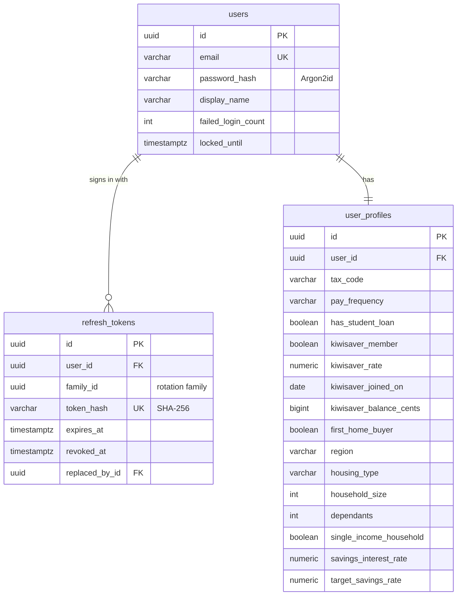
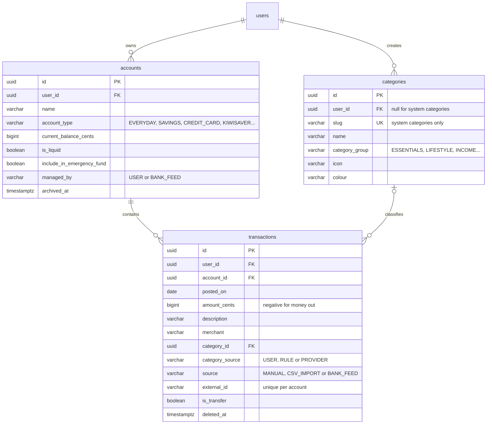
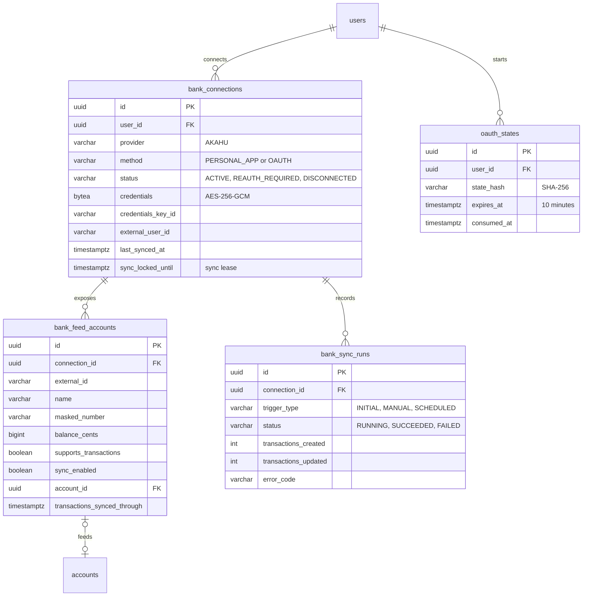
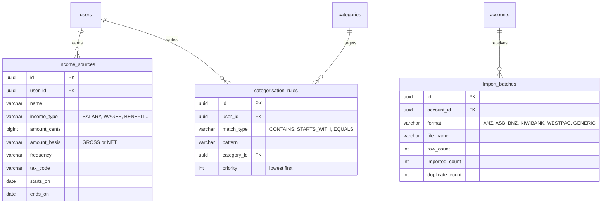
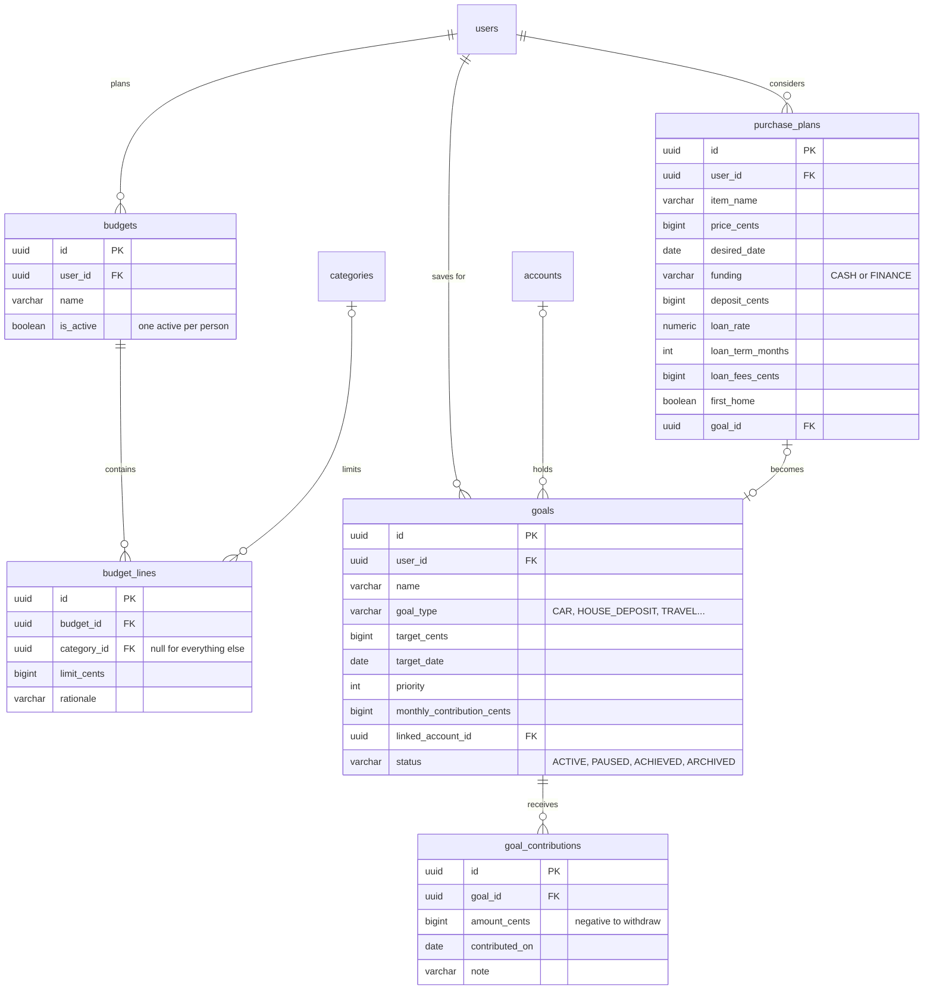

# Data model

> The PostgreSQL schema behind Kiwi Finance, and the conventions it follows.

The schema is created and evolved by Flyway migrations in
`backend/api/src/main/resources/db/migration`. Hibernate only validates it.

**Contents**

1. [Conventions](#1-conventions)
2. [Identity and profile](#2-identity-and-profile)
3. [Accounts, categories and transactions](#3-accounts-categories-and-transactions)
4. [Bank feeds](#4-bank-feeds)
5. [Income, rules and imports](#5-income-rules-and-imports)
6. [Budgets, goals and plans](#6-budgets-goals-and-plans)
7. [Migrations](#7-migrations)

---

## 1. Conventions

| Topic | Convention |
| --- | --- |
| Keys | `UUID` primary keys generated by the application as UUIDv7, so they sort by creation time |
| Ownership | Every user-owned table has a `user_id` foreign key with `ON DELETE CASCADE`, and an index that starts with it |
| Money | `BIGINT` cents in columns ending `_cents`. Never `NUMERIC` or floating point. |
| Rates | `NUMERIC` fractions, for example `0.035` for 3.5% |
| Time | Calendar dates are `DATE` in New Zealand time. Moments are `TIMESTAMPTZ` stored in UTC. |
| Auditing | `created_at` and `updated_at` on every table, filled by JPA auditing |
| Enumerations | `VARCHAR` with a `CHECK` constraint listing the allowed values |
| Soft deletion | Only where history matters: bank-feed transactions (`deleted_at`) and connections (`disconnected_at`) |
| Names | `snake_case`, plural table names |

Deleting a user removes everything they own in one statement, which is how account deletion
meets the Privacy Act 2020.

---

## 2. Identity and profile

Refresh tokens are stored only as hashes. Each refresh replaces the token and records the
link in `replaced_by_id`; presenting a replaced token revokes the whole `family_id`.

---

## 3. Accounts, categories and transactions

- **System categories** have no `user_id`. Thirty-one New Zealand categories are seeded,
  from Rent and Groceries to KiwiSaver and Takeaways, each in a group that drives
  analysis: essentials, lifestyle, income, savings, debt and transfers.
- **`category_source`** records who chose the category. A person's choice (`USER`) is never
  overwritten by a rule or a bank feed.
- **`external_id`** makes imports idempotent. Bank-feed rows use Akahu's transaction ID;
  CSV rows use a fingerprint of date, amount and description, numbered when identical rows
  repeat, so importing the same statement twice adds nothing.
- **Transfers** between a person's own accounts are excluded from income and spending.

---

## 4. Bank feeds

- Credentials are encrypted with the connection ID as associated data, so an encrypted
  value copied to another row cannot be decrypted. `credentials_key_id` allows key rotation.
- A partial unique index allows one active connection per person and provider.
- `sync_locked_until` is a lease taken with a compare-and-set update, so two servers can
  never sync the same connection at once. It is released in the same transaction that records
  the sync's outcome, so a sync that shows as finished can always be followed by another.
- A feed account only syncs when the person turns it on. Turning it on creates or links a
  Kiwi Finance account with `managed_by = BANK_FEED`.

---

## 5. Income, rules and imports

---

## 6. Budgets, goals and plans

Results such as budget progress, goal projections and affordability are calculated on
request by the finance engine and never stored, so they always reflect the latest
transactions and rules.

---

### Preferences and recorded money movements

`user_preferences` holds one row per person: the home screen layout as JSON (an ordered list of
widgets and their sizes, or null for the default) and whether to remind them to choose an
emergency fund account. Only one account per person can be the emergency fund, enforced by a
partial unique index on `accounts`.

`money_movements` records a transfer, withdrawal or deposit the person tells us about. Each
creates one transaction per account it touches, linked by `transactions.movement_id`. On a
bank-fed account that transaction is marked `awaiting_bank_copy` until a bank transaction for the
same amount arrives within seven days; the recorded one is then removed so nothing is counted twice. A move
can take an account at most $100 overdrawn, unless the account is a credit card or loan.

## 7. Migrations

| Version | Creates |
| :-: | --- |
| V1 | `users`, `refresh_tokens`, `user_profiles` |
| V2 | `accounts`, `categories` (with the NZ system categories), `transactions` |
| V3 | `bank_connections`, `bank_feed_accounts`, `bank_sync_runs`, `oauth_states` |
| V4 | `income_sources`, `categorisation_rules`, `import_batches` |
| V5 | `budgets`, `budget_lines`, `goals`, `goal_contributions`, `purchase_plans` |
| V6 | `user_preferences` (home layout, reminders), `money_movements`, one emergency fund account per person, and the link from a recorded movement to its transactions |

Migrations are never edited after they are merged. Every change is a new version.
