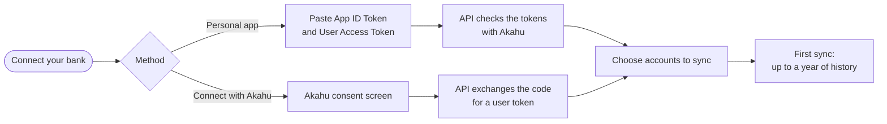
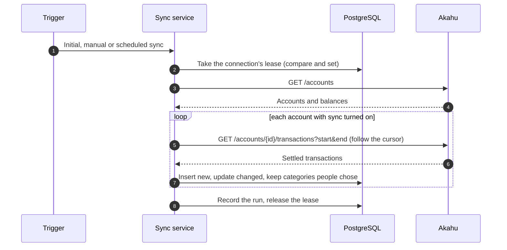

# Akahu bank feeds

> How people connect their banks to Kiwi Finance, how sync works, and how to run it.

[Akahu](https://www.akahu.nz) is New Zealand's open finance platform. It gives read-only
access to accounts and transactions at ANZ, ASB, BNZ, Kiwibank, Westpac and most other New
Zealand banks and KiwiSaver providers. Each person connects **their own** Akahu account, and
Kiwi Finance never sees a banking login. The reasoning is in
[ADR 0006](../adr/0006-akahu-bank-feeds.md).

**Contents**

1. [Two ways to connect](#1-two-ways-to-connect)
2. [For people connecting their bank](#2-for-people-connecting-their-bank)
3. [The personalised setup guide](#3-the-personalised-setup-guide)
4. [How sync works](#4-how-sync-works)
5. [Security and privacy](#5-security-and-privacy)
6. [Running it](#6-running-it)
7. [The sandbox](#7-the-sandbox)
8. [Troubleshooting](#8-troubleshooting)

---

## 1. Two ways to connect

| | Personal app | Connect with Akahu (OAuth) |
| --- | --- | --- |
| **How it feels** | Create a personal app in Akahu and paste two tokens into Kiwi Finance | Sign in to Akahu, choose banks, come straight back |
| **Time** | About 10 minutes | About 3 minutes |
| **Cost** | Free for personal use | Requires the deployment to have a registered Akahu app |
| **Available** | Always | When the deployment's Akahu app credentials are configured |
| **Data freshness** | Akahu refreshes from the bank about once a day | As often as the registered app allows |

Both end in the same place: a connection whose accounts the person chooses to sync.

---

## 2. For people connecting their bank

### Option A: your own personal app

1. **Create a free Akahu account** at [my.akahu.nz](https://my.akahu.nz) with your email
   address.
2. **Connect your banks in Akahu.** Add each bank or KiwiSaver provider you want to see.
   You sign in to your bank through Akahu's secure connection.
3. **Find your personal app tokens.** Open the
   [Developers page](https://my.akahu.nz/developers), accept the developer terms and turn on
   two-factor authentication if asked. Your personal app shows two tokens: an **App ID
   Token** starting `app_token_` and a **User Access Token** starting `user_token_`.
4. **Paste both tokens into Kiwi Finance** on the Connect your bank screen. They are checked
   with Akahu straight away and stored encrypted.
5. **Choose the accounts to sync.** Each account can be added as a new Kiwi Finance account
   or linked to one you have been tracking by hand.
6. **Bring in your transactions.** The first sync fetches up to a year of history and sorts
   it into categories, usually in under a minute.

> [!TIP]
> Treat the tokens like a password. Only paste them into Kiwi Finance, and never send them
> by email or message. Akahu's own guide to personal apps is at
> [developers.akahu.nz](https://developers.akahu.nz/docs/personal-apps).

### Option B: Connect with Akahu

1. Press **Connect with Akahu**.
2. Sign in to Akahu or create a free account, then choose which banks to share.
3. You come straight back to Kiwi Finance to choose accounts and run the first sync.

---

## 3. The personalised setup guide

`GET /api/v1/bank-feeds/akahu/setup-guide` returns everything a client needs to show a
wizard tailored to one person: the methods available on this deployment, each method's
steps with a status, the action for the next step, security notes and troubleshooting.
The web app renders it directly, and the iOS app will too, so the guidance is identical
everywhere and can change without a client release.

| Overall state | When |
| --- | --- |
| `NOT_CONNECTED` | No active connection |
| `CHOOSE_ACCOUNTS` | Connected, but no account is syncing yet |
| `SYNCING` | A sync is running |
| `CONNECTED` | Accounts are syncing and the last sync succeeded |
| `NEEDS_ATTENTION` | Akahu rejected the tokens, shared no accounts, or the last sync failed |

Each step is `DONE`, `CURRENT`, `TODO` or `ATTENTION`. A step that needs input carries an
action the client knows how to perform: open a link, enter or replace tokens, start OAuth,
choose accounts or sync now. The wording lives in
`backend/api/src/main/resources/bankfeed/akahu-setup-guide.json`.

---

## 4. How sync works

| Rule | Why |
| --- | --- |
| The first sync of an account reads 365 days | Enough history for typical months, recurring bills and trends |
| Later syncs re-read the last 7 days | Banks sometimes post transactions late or change them after settlement |
| Transactions are matched on Akahu's transaction ID | Running a sync twice never creates duplicates |
| A category chosen by the person is never overwritten | Their choice beats Akahu's category and any rule |
| Akahu's categories are mapped to Kiwi Finance categories when there is no rule | Most transactions arrive already categorised |
| Akahu transfers are marked as transfers | Moving money between your own accounts is not spending |
| A lease guards each connection | Two servers can never sync the same connection at once |
| Syncs run on virtual threads, outside database transactions | A slow bank never holds a database connection |
| Scheduled sync runs every six hours | Matches how often personal app data refreshes |

When Akahu rejects the stored tokens, the connection moves to `REAUTH_REQUIRED` and the
setup guide asks the person to reconnect. Transactions already imported are kept.

---

## 5. Security and privacy

- **Read-only.** Kiwi Finance can see balances and transactions. It cannot move money.
- **No banking logins.** People sign in to their bank through Akahu.
- **Encrypted tokens.** Tokens are encrypted with AES-256-GCM using the connection ID as
  associated data, and stored with the identifier of the key that encrypted them. The API
  never returns them.
- **Single-use OAuth state.** Each authorisation has a random `state`, stored only as a
  hash, valid for 10 minutes and usable once.
- **Disconnecting.** Disconnecting stops syncing and, for OAuth connections, revokes access
  at Akahu. Personal app users can also regenerate their tokens in Akahu.
- **Deleting an account** removes every connection and revokes access after the deletion
  has committed.
- **Nothing sensitive in logs.** Tokens, descriptions and amounts are never logged.

---

## 6. Running it

### Personal apps

Nothing to configure. Personal apps work on every deployment.

### Connect with Akahu (OAuth)

1. Register an app with Akahu and agree its terms.
2. Register the redirect URI, for example
   `https://app.example.nz/connect/akahu/callback`.
3. Set `KIWI_AKAHU_APP_TOKEN`, `KIWI_AKAHU_APP_SECRET` and `KIWI_AKAHU_REDIRECT_URI`
   (see [Configuration](../configuration.md#akahu)).

The setup guide offers OAuth as soon as the configuration is present, with no code change.

### Monitoring

Every sync is recorded in `bank_sync_runs` with its trigger, status, counts and an error
code when it fails. People see the latest run on the Connect your bank screen, and
`GET /bank-feeds/connections/{id}/syncs` returns the history.

| Error code | Meaning |
| --- | --- |
| `akahu_tokens_rejected` | Tokens were revoked or regenerated; the person must reconnect |
| `akahu_unavailable` | Akahu did not respond in time; the next scheduled sync retries |
| `internal_error` | Something unexpected failed; the server log has the details, without personal data |

Asking for a sync while one is running returns `409 sync_in_progress` instead of starting a
second run.

---

## 7. The sandbox

Start the API with `--spring.profiles.active=local,sandbox` to use a built-in stand-in for
Akahu. It serves the same endpoints with 13 months of realistic data.

| To try | Do this |
| --- | --- |
| Personal app | Enter `app_token_sandbox_demo` and `user_token_sandbox_demo` (any suffix works) |
| OAuth | Press **Connect with Akahu** and approve on the sandbox consent page |
| A connected account | Sign in as `demo@kiwifinance.nz` with `kiwi-demo-2026` |

The end-to-end tests use the sandbox for both methods.

---

## 8. Troubleshooting

| Problem | What to do |
| --- | --- |
| **Akahu says my tokens are invalid** | Copy both tokens again from the Developers page in Akahu, including the `app_token_` and `user_token_` prefixes and no spaces. Regenerated tokens replace the old ones. |
| **An account is missing** | Connect the bank in Akahu, then press **Sync now**. The account appears, ready to choose. |
| **Today's transactions aren't showing** | Banks share settled transactions, which can take a day or two. Personal apps refresh about once a day. |
| **I want to stop sharing my data** | Disconnect in Kiwi Finance. To withdraw access completely, also revoke access or regenerate your tokens in Akahu. |
| **"Connect with Akahu" is unavailable** | The deployment has no registered Akahu app. Use your own personal app instead. |
