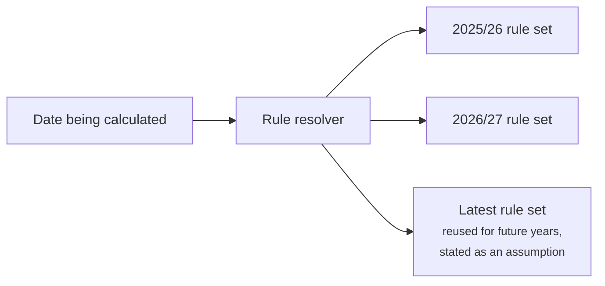
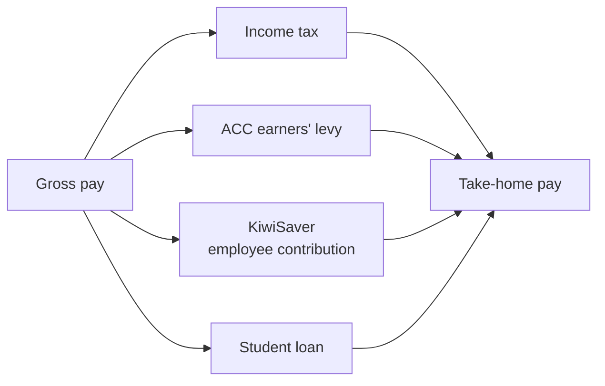
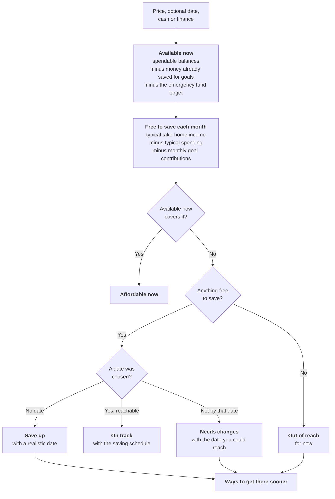

# New Zealand Financial Rules

> The New Zealand rules Kiwi Finance models, how they are kept current, and the planning
> algorithms built on top of them.

> [!IMPORTANT]
> Rates and thresholds change. The values in this document illustrate the structure of
> each rule. The authoritative values live in the versioned rule sets in
> `backend/finance-engine`, each of which records its sources and the date it was last
> verified against Inland Revenue, ACC and KiwiSaver publications.

**Contents**

1. [How rules are versioned](#1-how-rules-are-versioned)
2. [Income and deductions](#2-income-and-deductions)
3. [KiwiSaver](#3-kiwisaver)
4. [Savings and interest](#4-savings-and-interest)
5. [Pay frequencies](#5-pay-frequencies)
6. [Emergency fund](#6-emergency-fund)
7. [Affordability](#7-affordability)
8. [Purchase planning](#8-purchase-planning)
9. [Typical months](#9-typical-months)
10. [Budgets](#10-budgets)
11. [Goals](#11-goals)
12. [Kiwi Score, streaks and badges](#12-kiwi-score-streaks-and-badges)

---

## 1. How rules are versioned

The New Zealand tax year runs from **1 April to 31 March**. Each tax year has its own
typed rule set, and rules that change part-way through a year are stored as dated entries
within it.



- A projection that crosses 1 April switches to the next year's rules automatically.
- Projections beyond the latest published year reuse the latest rules, and the explanation
  says so.
- Updating for a new tax year means adding a rule set and its payslip fixtures. No
  calculation code changes.

| Tax year | ACC earners' levy | Default KiwiSaver rate | Sources |
| --- | --- | :-: | --- |
| 2025/26 | 1.67% up to $152,790 | 3% | Inland Revenue, ACC |
| 2026/27 | 1.75% up to $156,641 | 3.5% | Inland Revenue, ACC |

---

## 2. Income and deductions

### Income tax

Progressive rates on annual taxable income, in effect since 31 July 2024 and used for both
modelled tax years:

| Taxable income | Rate |
| --- | :-: |
| $0 to $15,600 | 10.5% |
| $15,601 to $53,500 | 17.5% |
| $53,501 to $78,100 | 30% |
| $78,101 to $180,000 | 33% |
| Over $180,000 | 39% |

### Other deductions and credits

| Rule | How it is modelled |
| --- | --- |
| **ACC earners' levy** | A flat rate on earnings up to an annual maximum, both set per tax year (see above). |
| **Student loan repayments** | 12% of income above the $24,128 annual threshold for main income, or of all income on a secondary tax code. Turned on in the person's profile, the equivalent of the `SL` suffix on a tax code. |
| **Independent earner tax credit** | Up to $520 a year with the `ME` tax code, for income from $24,000 to $70,000, reducing by 13 cents per dollar above $66,000. |
| **Tax codes** | `M` and `ME` for main income; `SB`, `S`, `SH`, `ST` and `SA` for secondary income, each taxed at its flat secondary rate. |
| **Other income** | Benefits, pensions, Working for Families and other payments are recorded as income sources so they count towards cash flow. Eligibility is not assessed. |

### Pay calculator



Deductions are worked out on the annual amount and spread evenly across pay periods. The
calculator also works backwards from a known take-home amount to the gross pay that
produces it, because that is how most people know their income. It reports the employer's
KiwiSaver contribution after employer superannuation contribution tax (ESCT), using the
ESCT bands of $18,720, $64,200, $93,720 and $216,000.

---

## 3. KiwiSaver

| Rule | Setting |
| --- | --- |
| **Employee contribution rates** | 3%, 3.5%, 4%, 6%, 8% or 10% of gross pay |
| **Default rate** | 3% until 31 March 2026, then 3.5% from 1 April 2026 |
| **Employer contribution** | The default rate, less ESCT |
| **Government contribution** | 25 cents per dollar of member contributions, up to $260.72 a year, from 1 July 2025. Not paid to members earning over $180,000. |
| **First-home withdrawal** | Available after three years of membership, leaving at least $1,000 in the account |

KiwiSaver balances count towards net worth but **not** towards money available for everyday
purchases or the emergency fund. They appear in house-deposit plans only when the person is
eligible for a first-home withdrawal.

---

## 4. Savings and interest

| Rule | How it is modelled |
| --- | --- |
| **Interest** | Savings projections add interest compounded monthly at the person's savings account rate, set in their profile (2.5% a year unless they change it). |
| **Tax on interest** | Not deducted. At typical savings rates the difference over the life of a goal is small, and every projection lists the rate it assumed. |
| **Rounding** | Money is held in cents and rounded once, at the end of a calculation. |

---

## 5. Pay frequencies

New Zealanders are paid weekly, fortnightly, four-weekly or monthly, and plans are shown in
the person's own rhythm.

| Frequency | Periods per year |
| --- | :-: |
| Weekly | 52 |
| Fortnightly | 26 |
| Four-weekly | 13 |
| Monthly | 12 |

Conversions go through the annual amount, so *$100 a week* becomes *$5,200 a year* and then
*$433.33 a month*, with rounding to the cent happening once at the end.

---

## 6. Emergency fund

The emergency fund target is built from the person's **own essential spending**, not a
generic figure.

```
target = typical monthly essential spending × months of cover
```

**Essential spending** is everything in the essentials group: rent or mortgage, rates,
power, internet and phone, groceries, transport, insurance, health, childcare and similar.
It is measured as a [typical month](#9-typical-months) over the last six months.

**Months of cover** start at 3 and increase for higher-risk situations:

| Situation | Adjustment |
| --- | :-: |
| Starting point | 3 months |
| Income varies month to month | +1 |
| Self-employed or contract work | +1 |
| Others depend on this income | +1 |
| The household relies on one income | +1 |
| Upper limit | 6 months |

The fund counts only accounts the person marks as part of it. KiwiSaver, term deposits and
investments are excluded.

**Milestones** make the target feel reachable: the first $1,000, one month of essentials,
three months, and fully funded. **The plan** suggests a monthly amount, shown per pay
period, of no more than half the person's typical surplus, and the date that reaches the
target. The target is recalculated from the latest six months every time, so it rises when
essential costs rise.

---

## 7. Affordability

The affordability engine answers four questions with one calculation:
*Can I afford it now? By my date? If not, when? What would need to change?*



- The emergency fund **target**, not just its balance, is protected, so a purchase never
  leaves the safety net short.
- When the purchase is financed, the deposit is what must be saved, and the verdict is
  *needs changes* whenever the repayments are more than the person has free each month.
- "Typical" means a [typical month](#9-typical-months) over the last six months.

**Levers** show what would change the answer, each with the date it would bring:

1. Save a specific extra amount each pay period.
2. Spend less in named lifestyle categories, matching the person's own lower-spending
   months, one at a time and all together.
3. Pause other goals and redirect their contributions.
4. For eligible first-home buyers, use a KiwiSaver first-home withdrawal.
5. Aim for the realistic date instead.

Using the emergency fund is never recommended. If it is the only way to afford something
now, the result says so as a warning.

---

## 8. Purchase planning

In the web app, an answer to "Can I afford it?" can be saved straight as a **savings goal**,
with the target, monthly amount and date filled in. The API can also keep a question as a
**purchase plan**, reassessed every time it is read so it reflects the latest income,
spending and goals, and turn it into a goal later.

| Purchase | What the plan covers |
| --- | --- |
| **Paid in cash** | The saving needed, per pay period, and the realistic date |
| **Financed** | The deposit to save, plus weekly, fortnightly and monthly repayments, total interest, fees and total repaid. Repayments are compared with what the person has free each month. |
| **First home** | Adds the KiwiSaver first-home withdrawal for eligible members |

The Learn section covers the wider picture in plain English, including the true cost of
running a car and saving for a house deposit.

---

## 9. Typical months

Most figures start from a **typical month**: the average of the last six months. One
unusually high month (more than twice the median) is left out, so a one-off holiday or a
bonus does not distort the picture.

An average rather than a median is used deliberately. Fortnightly pay and weekly rent make
some months contain three pays or five rent payments, and an average reflects those months
in proportion, where a median would understate them.

---

## 10. Budgets

1. Each category's limit starts at its typical monthly spending, rounded up to the next $10.
2. If that leaves less than the person's savings target (15% of income unless they change
   it), lifestyle categories are trimmed towards the person's own lower-spending months,
   never below them, until the target is met or nothing more can be trimmed.
3. Essentials are never trimmed.

During the month each line is **on track**, **at risk** (spending more than 15% ahead of an
even pace through the month) or **over**.

---

## 11. Goals

Each goal is projected forward from its saved amount and monthly contribution, with
interest as described in [section 4](#4-savings-and-interest).

| Status | When |
| --- | --- |
| On track | The projected date is on or before the target date, or there is no target date |
| Behind | The projected date is after the target date, or the goal is never reached at the current contribution |
| Achieved | The saved amount reaches the target |
| Not started | Nothing saved and no monthly contribution yet |

Goals that are behind show the monthly amount needed to hit the target date. Milestones
mark 25%, 50%, 75% and 100%.

---

## 12. Kiwi Score, streaks and badges

The **Kiwi Score** sums up financial health from 0 to 100, as a weighted average of six
parts:

| Part | Weight | Full marks when |
| --- | :-: | --- |
| Savings rate | 25% | 20% or more of income is kept in a typical month |
| Emergency fund | 25% | The fund reaches its target |
| Living within your means | 15% | Spending is below income in each of the last three months |
| Budget | 15% | Every budget category stayed on track last month |
| Credit card and loan debt | 10% | No card or loan balances |
| Goals | 10% | Every active goal is on track |

| Score | Band |
| :-: | --- |
| 80 to 100 | Thriving |
| 60 to 79 | Solid |
| 40 to 59 | Building |
| 0 to 39 | Getting started |

The score always comes with one next step: the tip from the part with the most room to
improve, weighted by importance.

**Streaks** count consecutive months spending less than you earn, consecutive days without
lifestyle spending, no-spend days this month, and weeks under the lifestyle budget.
**Badges** mark milestones such as the first $1,000 in the emergency fund, a month within
budget and every transaction categorised. Thirteen are available.
