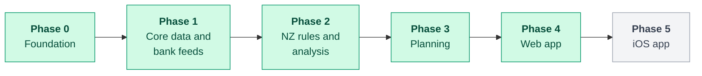

# Roadmap

> How Kiwi Finance is delivered: backend first, then the web app, then iOS.

| Phase | Theme | Status |
| :-: | --- | --- |
| 0 | Foundation | Complete |
| 1 | Core data and bank feeds | Complete |
| 2 | NZ rules and analysis | Complete |
| 3 | Planning | Complete |
| 4 | Web app (Next.js) | Complete |
| 5 | iOS app (SwiftUI) | Planned |

Phases 0 to 3 complete the backend before frontend work begins. The web app and iOS app
consume the API and never re-implement financial logic.

---

## Phase 0: Foundation

**Outcome:** a repeatable build, local infrastructure and a running API skeleton.

- [x] Gradle multi-project build with a version catalog (`api`, `finance-engine`)
- [x] Formatting enforced with Spotless
- [x] Docker Compose PostgreSQL with development and test databases
- [x] Spring Boot application with typed configuration and Flyway migrations
- [x] Problem-details error handling and stable error codes
- [x] Security baseline and health checks
- [x] Continuous integration that checks only what changed

## Phase 1: Core data and bank feeds

**Outcome:** a person can sign up, connect their bank through Akahu and see their
accounts and transactions in the API.

- [x] Registration, sign-in, rotating refresh tokens, sign-out, temporary lockout
- [x] Accounts
- [x] NZ default categories and custom categories
- [x] Transactions with filtering and cursor pagination
- [x] Akahu personal-app connections
- [x] Akahu OAuth connections for registered deployments
- [x] Choosing and linking Akahu accounts
- [x] Scheduled and on-demand sync with idempotent upserts
- [x] Setup guide tailored to each person's progress
- [x] Profile and NZ settings (tax code, KiwiSaver, region, household)
- [x] CSV import for institutions Akahu does not cover
- [x] Categorisation rules
- [x] Income sources

## Phase 2: NZ rules and analysis

**Outcome:** the API explains where money goes in a New Zealand context.

- [x] Money and time primitives in the finance engine
- [x] Versioned NZ rule sets with payslip fixtures
- [x] Pay calculator
- [x] Cash flow, spending breakdown and trends
- [x] Recurring payment and subscription detection
- [x] Insights

## Phase 3: Planning

**Outcome:** the API answers "Can I afford this?" and plans the way there.

- [x] Budget recommendations and budget tracking
- [x] Goals, contributions and projections
- [x] Emergency fund target, progress and guidance
- [x] Affordability and time-to-afford
- [x] Purchase plans and loan comparisons
- [x] Education content and glossary
- [x] Kiwi Score, streaks and achievements
- [x] Akahu sandbox and a seeded demo account

## Phase 4: Web app

**Outcome:** every v1 feature is available in the browser.

- [x] Next.js app with backend-for-frontend session handling
- [x] Design system on Tailwind CSS and Radix UI
- [x] Bank connection wizard
- [x] Overview, spending, transactions, budget, goals, affordability, emergency fund, learn and settings
- [x] Public pay calculator
- [x] Playwright journeys on desktop and phone sizes, run against the real API
- [x] Single-file demo build on recorded sandbox data
- [x] Automated WCAG 2.2 AA checks on every page
- [x] Download all your data from Settings
- [x] Home screen widgets you can move, resize, add and remove, saved to your account
- [x] One emergency fund account, chosen in one place, with reminders you can turn off
- [x] Record transfers, withdrawals and deposits, reconciled with bank feeds
- [x] Insights drawn from budgets, goals, debt, bills and balances, each with an action
- [x] Goal suggestions by urgency and what you can afford
- [x] Run the whole app in GitHub Codespaces or with one Docker Compose command
- [x] Car and home planner with finance options and budget impact
- [x] Prompts to categorise ATM and cash withdrawals
- [x] Guided setup for new accounts
- [x] Change name, email and password, signing out other devices on a password change
- [x] Goal details in one place, with a celebration when a goal is reached
- [x] Progress with the last 12 months of saving alongside the Kiwi Score
- [x] Back links on nested pages and white cards throughout

## Phase 5: iOS app

**Outcome:** a native app with the same capabilities.

- [ ] SwiftUI app on a client generated from the OpenAPI contract
- [ ] Keychain storage and biometric unlock
- [ ] Offline overview
- [ ] TestFlight distribution

---

## Later

Ideas that the architecture already accommodates:

- A deployment guide for production hosting
- Akahu webhooks for near real-time updates (registered Akahu apps)
- Net worth tracking across assets and liabilities
- Reminders for bills and goal milestones
- Shared household budgets
